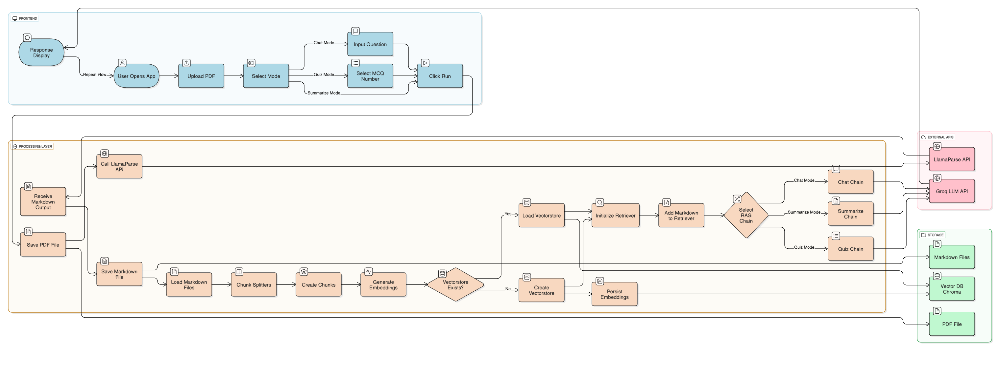

# 📄 PDF AI Assistant: Chat, Summarize & Quiz (RAG-based)

An interactive multi-mode AI assistant built using **LangChain**, **LlamaParse**, **ChromaDB**, and **Streamlit** that lets users:

- 📤 Upload a PDF
- 🗣️ Chat with it (ask questions)
- 🧾 Generate a full summary
- 🧠 Create a custom MCQ quiz

All powered by a **Retrieval-Augmented Generation (RAG)** pipeline!

---
## 📸 Screenshots


## 🚀 Features

- ✅ Upload and parse PDF documents
- ✅ Clean markdown extraction via LlamaParse
- ✅ Chunking and embedding with HuggingFace models
- ✅ Vector store with ChromaDB
- ✅ Chat, Summarize, or Quiz from one unified interface
- ✅ Dynamic question input for quizzes
- ✅ Modular architecture with reusable components

---

## 🧠 Tech Stack

| Layer        | Tools/Tech                             |
|--------------|----------------------------------------|
| UI           | Streamlit                              |
| LLM          | Groq (LLaMA 3.1 via `ChatGroq`)        |
| Embedding    | Hugging Face (`all-MiniLM-L6-v2`)      |
| Vector DB    | Chroma                                 |
| Parsing      | LlamaParse (via Llama Cloud API)       |
| RAG Engine   | LangChain + ParentDocumentRetriever    |

---

## 🧰 Requirements

- Python ≥ 3.10
- `.env` file with:
    ```
    LLAMA_CLOUD_API_KEY=your_llama_key_here
    GROQ_API_KEY=your_groq_key_here
    ```

- Install dependencies:
    ```bash
    pip install -r requirements.txt
    ```

---

## 🧪 Usage

### 🔧 Local Setup

Run the Streamlit app:
```bash
streamlit run app/streamlit_app.py
```

---

## 🧠 Modes

- **Chat Mode:** Ask questions about the document.
- **Summarize Mode:** Get a detailed, structured summary.
- **Quiz Mode:** Auto-generate MCQs with a custom question count.

